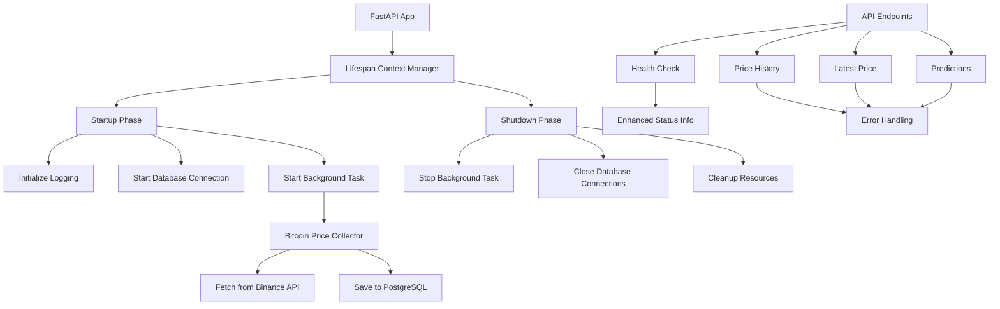

# Changelog - Bitcoin Price Pipeline

## [1.1.0] - 2025-07-26

### Alterações Significativas

#### Migração para Lifespan Events
- Substituído `@app.on_event("startup")` e `@app.on_event("shutdown")` por `lifespan` context manager
- Implementado gerenciamento de ciclo de vida da aplicação com `@asynccontextmanager`
- Corrigido warning de deprecação do FastAPI

#### Sistema de Logging Estruturado
- Criado módulo `utils/logger.py` com configuração centralizada de logging
- Implementado logger com formatação estruturada para facilitar análise
- Adicionado função `log_operation` para registrar operações com contexto
- Todos os componentes agora usam o mesmo sistema de logging

#### Melhorias no Tratamento de Erros
- Adicionado tratamento de exceções específicas (ConnectionError, TimeoutError, etc.)
- Implementado logging detalhado para erros com contexto completo
- Adicionado validação de parâmetros nos endpoints
- Melhorado feedback de erro para clientes da API

#### Graceful Shutdown
- Implementado encerramento gracioso para a tarefa de background
- Adicionado timeout para cancelamento de tarefas
- Melhorado gerenciamento de recursos durante o shutdown
- Implementado fechamento adequado da sessão HTTP

#### Endpoints Aprimorados
- Adicionado validação de entrada para todos os endpoints
- Implementado logging estruturado para todas as operações
- Melhorado tratamento de erros com mensagens descritivas e amigáveis
- Adicionado mensagens de erro específicas para diferentes cenários
- Adicionado métricas de desempenho nos logs

#### Health Check Aprimorado
- Implementado endpoint de health check com detalhes de status
- Adicionado verificação de saúde do coletor de preços
- Implementado detecção de problemas com base no tempo desde a última atualização
- Adicionado informações do sistema (versões do Python e FastAPI)

### Arquitetura


### Como Testar
1. Inicie a aplicação:
```bash
poetry run python src/main.py
```

2. Verifique o health check:
```bash
curl http://localhost:8000/health
```

3. Teste os endpoints:
```bash
curl http://localhost:8000/price/latest
curl "http://localhost:8000/price/history?limit=10&hours=1"
curl http://localhost:8000/price/predict
```

4. Verifique os logs para confirmar o funcionamento do sistema de logging.

### Observações
- O sistema agora segue as melhores práticas do FastAPI para gerenciamento de ciclo de vida
- O logging estruturado facilita a monitoração e troubleshooting
- O graceful shutdown garante que a aplicação possa ser encerrada sem perda de dados
- A validação de entrada protege contra requisições malformadas
- O health check aprimorado permite melhor monitoração da saúde do sistema